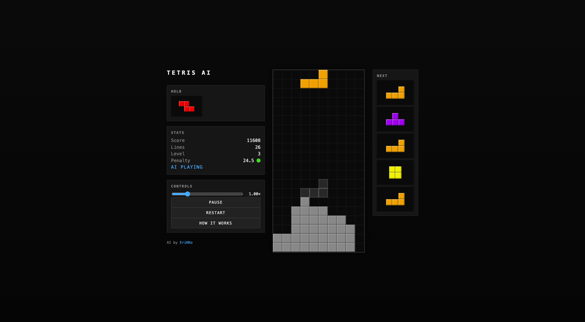

# tetris-ai-web

A browser port of [EriKKo/tetris-ai](https://github.com/EriKKo/tetris-ai) — the original Java AI now plays inside an HTML5 Canvas, watchable in real time.



## Running it locally

No build step. Serve the directory with any static file server, e.g.:

```sh
python3 -m http.server 8765
```

Then open <http://localhost:8765/>.

A plain `file://` open won't work because the code uses ES modules.

## How it works

- `tetris.js` — straight port of the Java AI: board model, tetrimino shapes, randomizer, penalty function, and the 1-ply solver. Same weights as the original.
- `renderer.js` — small HTML5 Canvas renderer (board, ghost piece, next + hold previews).
- `game.js` — game loop. Pieces spawn at the top and fall at level-based gravity. The AI shifts and rotates the active piece toward the column and orientation chosen by the solver, then hard-drops once aligned.
- `index.html` — the page itself, with a stats panel, a speed slider, and a "How it works" modal that walks through the penalty heuristic.

## Hosting

Drop the four `.js`/`.html` files (and the screenshot) onto any static host — GitHub Pages, Netlify, S3, etc. To embed in an existing page, copy the `<div class="app">` plus the `<script type="module">` from `index.html` into the host page.

## Credits

AI by [EriKKo](https://github.com/EriKKo). Web port and renderer by Erik Odenman with [Claude Code](https://claude.com/claude-code).
